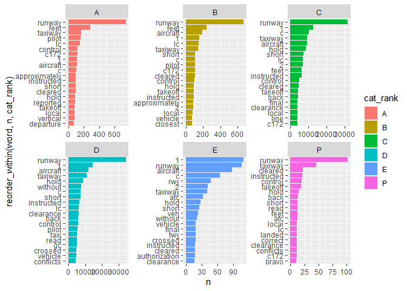
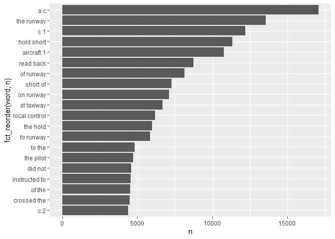

```r
library(tidyverse)
library(tidytext)
library(textrecipes)
library(widyr)
library(tidymodels)
library(here)
library(janitor)
tidymodels_prefer()
```


```r
dt <- read_csv(here("Data/runway_incursion_narrative.csv")) %>% 
  clean_names()
```


```r
tokens <- dt %>% 
  unnest_tokens(word, narrative) %>% 
  anti_join(get_stopwords())
```

```
## Joining, by = "word"
```

```r
token_cnts <- tokens %>% 
  select(-loc_id) %>% 
  count(cat_rank, word) %>% 
  group_by(cat_rank) %>% 
  slice_max(n, n=20, with_ties = FALSE)

token_cnts %>% 
  ggplot(aes(x = n, 
             y = reorder_within(word, n, cat_rank),
             fill = cat_rank)) +
  geom_col() +
  facet_wrap(vars(cat_rank), scales = "free")+
  scale_y_reordered()
```

<!-- -->

```r
bigrams <- dt %>% 
  unnest_tokens(word, narrative, token = "ngrams", n = 2)

bigrams_cnts <- bigrams %>% 
  count(word) %>% 
  slice_max(n, n = 20)
  
bigrams_cnts %>% 
  ggplot(aes(x=n, y = fct_reorder(word, n)))+
  geom_col()
```

<!-- -->


```r
initialsplit <- initial_split(dt, strata = )
```

