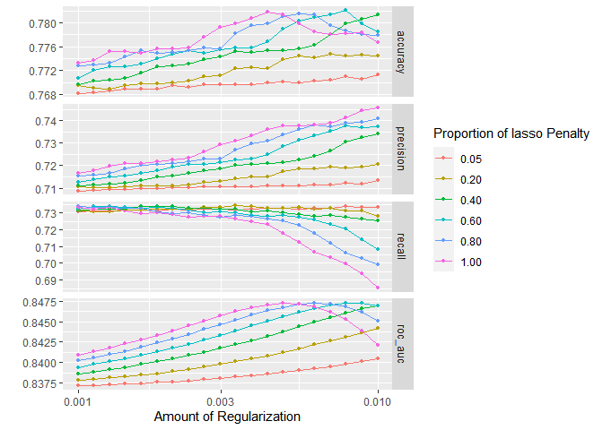

Load libraries


```r
library(tidyverse)
library(tidytext)
library(textrecipes)
library(widyr)
library(tidymodels)
library(here)
library(janitor)
library(hardhat)
library(themis)
tidymodels_prefer()
```

Read data, convert the outcome/label column to factor.\
For now try classifying only two categories. 3 categories that were relatively infrequent were dropped/


```r
dt <- read_csv(here("Data/runway_incursion_narrative.csv")) %>% 
  clean_names()
dt %>% count(cat_rank)
```

```
## # A tibble: 6 x 2
##   cat_rank     n
##   <chr>    <int>
## 1 A          142
## 2 B          126
## 3 C         7025
## 4 D        10245
## 5 E           34
## 6 P           29
```

```r
dt <- dt %>% 
  filter(cat_rank %in% c("C", "D")) %>% 
  mutate(cat_rank = factor(cat_rank)) 
```

Basic eda to see word and bigram frequencies.


```r
tokens <- dt %>% 
  unnest_tokens(word, narrative) %>% 
  anti_join(get_stopwords())
```

```
## Joining, by = "word"
```

```r
token_cnts <- tokens %>% 
  select(-loc_id) %>% 
  count(cat_rank, word) %>% 
  group_by(cat_rank) %>% 
  slice_max(n, n=20, with_ties = FALSE)

token_cnts %>% 
  ggplot(aes(x = n, 
             y = reorder_within(word, n, cat_rank),
             fill = cat_rank)) +
  geom_col() +
  facet_wrap(vars(cat_rank), scales = "free")+
  scale_y_reordered()
```

<!-- -->

```r
bigrams <- dt %>% 
  unnest_tokens(word, narrative, token = "ngrams", n = 2)

bigrams_cnts <- bigrams %>% 
  count(word) %>% 
  slice_max(n, n = 20)
  
bigrams_cnts %>% 
  ggplot(aes(x=n, y = fct_reorder(word, n)))+
  geom_col()
```

<!-- -->

Split data and create cross fold validation split.\
Since outcome levels are slightly imbalanced, splits are stratified.


```r
initialsplit <- initial_split(dt, strata = cat_rank )
dt_train <- training(initialsplit)
dt_test <- testing(initialsplit)
folds <- vfold_cv(dt_train, strata = cat_rank)
```


```r
#use_glmnet(cat_rank ~ ., data = dt_train)
```

**Recipe**

-   tokenize

-   remove stopwords

-   Only keep tokens that occur minimum 100 times but less that 1000 times. After filtering these out, keep only 5000 tokens.

-    tfidf

-   smote for imbalanced labels.

**Model**

-   Glmnet

-   Penalty and mixture tuned

Using sparse matrix representation to speed up.


```r
sparse_bp <- default_recipe_blueprint(composition = "dgCMatrix")

glmnet_recipe <- 
  recipe(cat_rank ~ ., data = dt_train) %>% 
  update_role(loc_id, new_role = "id") %>% 
  step_tokenize(narrative) %>% 
  step_stopwords(narrative) %>% 
  step_tokenfilter(narrative, max_times = 1000, 
                   min_times = 100, max_tokens = 5000) %>% 
  step_tfidf(narrative) %>% 
  step_smote(cat_rank)
  
glmnet_spec <- 
  logistic_reg(penalty = tune(), mixture = tune()) %>% 
  set_mode("classification") %>% 
  set_engine("glmnet") 

glmnet_workflow <- 
  workflow() %>% 
  add_recipe(glmnet_recipe, blueprint = sparse_bp) %>% 
  add_model(glmnet_spec) 

glmnet_grid <- tidyr::crossing(penalty = 10^seq(-3, -2, length.out = 20), mixture = c(0.05, 
    0.2, 0.4, 0.6, 0.8, 1)) 

doParallel::registerDoParallel()

glmnet_tune <- 
  tune_grid(glmnet_workflow, 
            resamples = folds, grid = glmnet_grid,   
            metrics = metric_set(accuracy, recall, precision, roc_auc),
            control = control_grid(save_pred = TRUE)) 
```


```r
autoplot(glmnet_tune)
```

<!-- -->

```r
glmnet_tune %>% show_best("accuracy")
```

```
## # A tibble: 5 x 8
##   penalty mixture .metric  .estimator  mean     n std_err .config               
##     <dbl>   <dbl> <chr>    <chr>      <dbl> <int>   <dbl> <chr>                 
## 1 0.00785     0.6 accuracy binary     0.782    10 0.00264 Preprocessor1_Model078
## 2 0.00428     1   accuracy binary     0.782    10 0.00255 Preprocessor1_Model113
## 3 0.00546     0.8 accuracy binary     0.782    10 0.00273 Preprocessor1_Model095
## 4 0.00616     0.8 accuracy binary     0.781    10 0.00262 Preprocessor1_Model096
## 5 0.00483     1   accuracy binary     0.781    10 0.00247 Preprocessor1_Model114
```

```r
glmnet_tune %>% show_best("roc_auc")
```

```
## # A tibble: 5 x 8
##   penalty mixture .metric .estimator  mean     n std_err .config               
##     <dbl>   <dbl> <chr>   <chr>      <dbl> <int>   <dbl> <chr>                 
## 1 0.00785     0.6 roc_auc binary     0.847    10 0.00250 Preprocessor1_Model078
## 2 0.00886     0.6 roc_auc binary     0.847    10 0.00251 Preprocessor1_Model079
## 3 0.00483     1   roc_auc binary     0.847    10 0.00248 Preprocessor1_Model114
## 4 0.00616     0.8 roc_auc binary     0.847    10 0.00250 Preprocessor1_Model096
## 5 0.00546     1   roc_auc binary     0.847    10 0.00248 Preprocessor1_Model115
```

```r
best_param <- glmnet_tune %>% select_best("roc_auc")
```


```r
glmnet_workflow_final <- glmnet_workflow %>% 
  finalize_workflow(parameters = best_param )

final_fit <- glmnet_workflow_final %>%
  last_fit(split = initialsplit)
```


```r
final_fit %>% collect_metrics()
```

```
## # A tibble: 2 x 4
##   .metric  .estimator .estimate .config             
##   <chr>    <chr>          <dbl> <chr>               
## 1 accuracy binary         0.792 Preprocessor1_Model1
## 2 roc_auc  binary         0.858 Preprocessor1_Model1
```

```r
final_fit %>% collect_predictions() %>% 
  conf_mat(truth = cat_rank, estimate = .pred_class)
```

```
##           Truth
## Prediction    C    D
##          C 1282  422
##          D  475 2140
```
